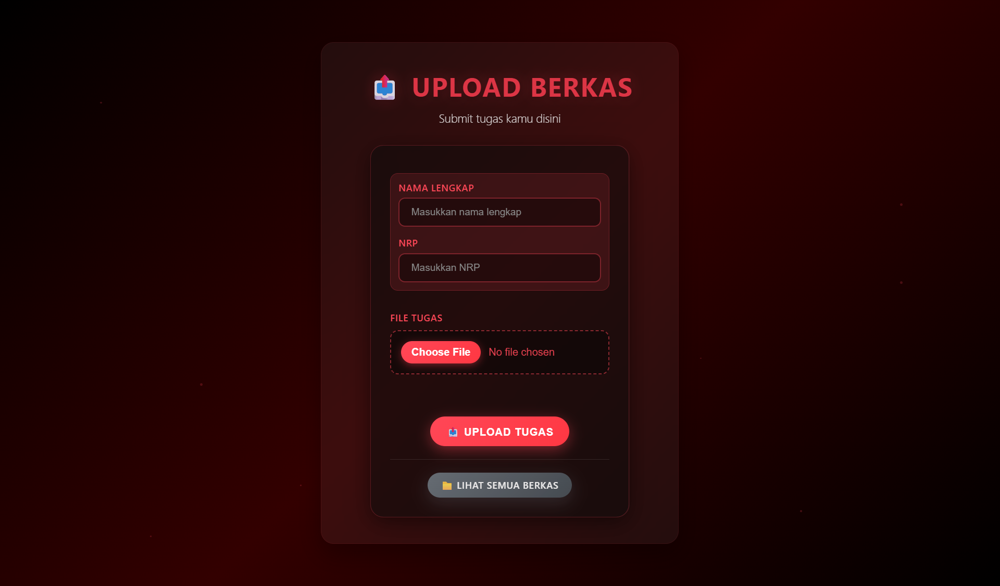
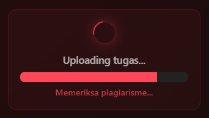
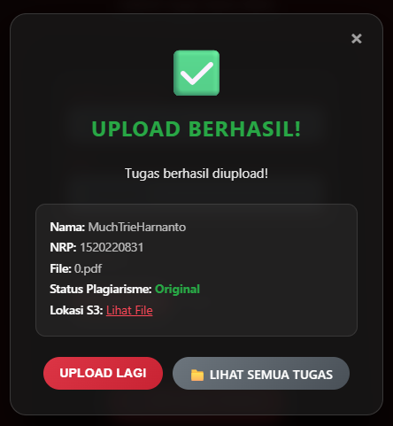

# Aplikasi Deteksi Plagiarisme Tugas

Aplikasi berbasis web untuk mengunggah tugas dengan kemampuan deteksi plagiarisme otomatis, dibangun dengan Node.js dan layanan AWS (S3, RDS, SNS, Lambda).

## Fitur Utama

- Upload tugas mahasiswa
- Deteksi plagiarisme otomatis
- Penyimpanan file di AWS S3
- Notifikasi melalui AWS SNS
- Pemrosesan notifikasi dengan AWS Lambda
- Tampilan daftar semua tugas yang diupload

## Screenshot Aplikasi

### 1. Halaman Upload Berkas



Halaman ini menampilkan form untuk mahasiswa mengunggah tugas. Form berisi field nama lengkap, NRP, dan fitur untuk memilih file tugas. Setelah semua field diisi, mahasiswa dapat mengklik tombol "UPLOAD TUGAS" untuk mengirim file.

### 2. Proses Upload dan Pengecekan Plagiarisme



Setelah mengklik tombol upload, sistem akan menampilkan indikator proses yang menunjukkan bahwa file sedang diunggah dan sistem sedang melakukan pengecekan plagiarisme secara otomatis.

### 3. Notifikasi Duplikat Terdeteksi


Jika sistem mendeteksi file dengan nama yang sama telah diunggah sebelumnya oleh mahasiswa lain, sistem akan menampilkan pesan peringatan. Pesan ini menunjukkan bahwa upload dibatalkan karena terdeteksi sebagai plagiarisme, menampilkan informasi nama, NRP, nama file, dan status plagiarisme.

### 4. Upload Berhasil



Jika file berhasil diunggah (tidak terdeteksi duplikat), sistem akan menampilkan pesan sukses. Pesan ini menampilkan informasi nama, NRP, nama file, status plagiarisme (original), dan tautan untuk melihat file yang sudah diunggah di S3.

### 5. Halaman Daftar Berkas


Halaman ini menampilkan daftar semua file yang telah diunggah ke AWS S3. Pengguna dapat memfilter berkas berdasarkan jenis file (semua, dokumen, gambar, video, archive, lainnya) dan melakukan refresh untuk memperbarui daftar. Jika belum ada file yang diunggah, sistem akan menampilkan pesan dan tombol untuk mulai mengunggah.

### 6. Notifikasi Email Plagiarisme


Ketika sistem mendeteksi file duplikat (plagiarisme), secara otomatis sebuah email notifikasi akan dikirim melalui Amazon SNS. Email ini berisi informasi detail tentang file yang terdeteksi duplikat, termasuk nama mahasiswa, NRP, nama file, dan status. Fitur ini memungkinkan dosen atau administrator untuk segera mengetahui adanya upaya plagiarisme dan dapat mengambil tindakan yang sesuai.

## Teknologi yang Digunakan

- Node.js
- Express.js
- AWS SDK
- Amazon S3 (penyimpanan file)
- Amazon RDS (database)
- Amazon SNS (notifikasi)
- AWS Lambda (serverless computing)
- Amazon CloudWatch (monitoring dan logging)
- MySQL

## Cara Instalasi

### Prasyarat
- Node.js (versi 14 atau lebih baru)
- AWS Account dengan layanan:
  - S3 bucket
  - RDS MySQL database
  - SNS Topic
  - Lambda Function
  - IAM Role untuk Lambda
- Akses internet

### Langkah Instalasi
1. Clone repository ini
   ```bash
   git clone https://github.com/MuchTrie/Cloud-Computing_UTS-2.git
   cd Cloud-Computing_UTS-2/Program
   ```

2. Install dependencies
   ```bash
   npm install
   ```

3. Buat file `.env` di root project dengan konfigurasi berikut:
   ```
   # AWS Configuration
   AWS_ACCESS_KEY_ID=YOUR_AWS_ACCESS_KEY
   AWS_SECRET_ACCESS_KEY=YOUR_AWS_SECRET_KEY
   AWS_REGION=YOUR_AWS_REGION
   S3_BUCKET_NAME=YOUR_S3_BUCKET_NAME

   # Database Configuration
   DB_HOST=YOUR_RDS_ENDPOINT
   DB_PORT=3306
   DB_USER=YOUR_DB_USER
   DB_PASSWORD=YOUR_DB_PASSWORD
   DB_NAME=YOUR_DB_NAME

   # SNS Configuration
   SNS_TOPIC_ARN=YOUR_SNS_TOPIC_ARN
   ```

4. Siapkan database dengan tabel yang diperlukan
   ```bash
   node test-connection.js
   ```
   Script ini akan mengecek koneksi ke database dan membuat tabel yang diperlukan jika belum ada.

## Cara Menjalankan

1. Start server aplikasi
   ```bash
   npm start
   ```
   Atau
   ```bash
   node index.js
   ```

2. Akses aplikasi melalui browser
   ```
   http://localhost:3000
   ```

3. Fitur yang tersedia:
   - Halaman utama: Upload file tugas (`http://localhost:3000/`)
   - Lihat daftar file: Daftar semua tugas yang sudah diupload (`http://localhost:3000/files`)

## Konfigurasi AWS

### Amazon S3
- Buat S3 bucket baru
- Atur permission untuk public read (opsional, tergantung kebutuhan)
- Update file `.env` dengan nama bucket

### Amazon RDS
- Setup database MySQL di RDS
- Buat database baru sesuai nama di `.env`
- Pastikan security group mengizinkan koneksi dari aplikasi

### Amazon SNS
- Buat SNS topic baru
- Tambahkan subscription email untuk menerima notifikasi
- Konfirmasi subscription melalui email
- Update file `.env` dengan ARN topic

### AWS Lambda
- Buat Lambda function baru untuk memproses notifikasi plagiarisme
- Konfigurasikan trigger untuk menerima notifikasi dari SNS Topic
- Buat IAM Role dengan izin:
  - SNS:Subscribe
  - SNS:Receive
  - CloudWatch:PutMetricData
  - CloudWatch:PutLogEvents
  - SES:SendEmail (opsional, untuk notifikasi email lanjutan)
- Upload kode Lambda menggunakan template Node.js
- Tetapkan memory dan timeout yang sesuai (128MB dan 10 detik biasanya cukup)
- Aktifkan CloudWatch Logs untuk monitoring
- Lambda akan menerima dan memproses notifikasi file duplikat secara otomatis

## Arsitektur Lambda untuk Deteksi Plagiarisme

Aplikasi ini menggunakan AWS Lambda untuk memproses notifikasi saat terdeteksi file duplikat (plagiarisme). Berikut adalah alur kerjanya:

1. **Deteksi Plagiarisme**: Ketika aplikasi Node.js mendeteksi adanya file duplikat saat upload, aplikasi akan mengirim notifikasi ke SNS Topic.

2. **Trigger Lambda**: SNS Topic yang dikonfigurasi sebagai trigger akan otomatis memanggil fungsi Lambda.

3. **Pemrosesan Lambda**: Function Lambda akan memproses data file plagiarisme, termasuk:
   - Mengekstrak informasi dari notifikasi (nama, NRP, nama file)
   - Memformat pesan notifikasi
   - Mencatat log ke CloudWatch
   - Mengirim notifikasi terformat ke tujuan yang ditentukan

4. **Contoh Kode Lambda**:
   ```javascript
   exports.handler = async (event) => {
     const record = event.Records[0];
     const msg = JSON.parse(record.Sns.Message);
     
     const emailBody = `
       Deteksi Plagiarisme Tugas!
       Nama: ${msg.nama}
       NRP: ${msg.nrp}
       File: ${msg.filename}
       Status: ${msg.status}
     `;
     
     console.log(emailBody);
     
     // Tambahkan kode untuk pemrosesan tambahan jika diperlukan
     // Misalnya, menyimpan ke database, mengirim notifikasi tambahan, dll.
     
     return {
       statusCode: 200,
       body: 'OK'
     };
   };
   ```

Dengan arsitektur ini, sistem dapat menangani notifikasi plagiarisme secara real-time, skalabel, dan tanpa memerlukan server tambahan (serverless). Lambda hanya berjalan saat diperlukan, menghemat biaya dan sumber daya.

5. **Fitur Tambahan Lambda**:
   - **Logging ke CloudWatch**: Semua deteksi plagiarisme dicatat dalam log CloudWatch untuk audit dan analisis
   - **Metrik Kustom**: Mengirim metrik ke CloudWatch untuk memantau tingkat plagiarisme
   - **Langkah-langkah pengamanan**: Fungsi Lambda memvalidasi input untuk menghindari injeksi
   - **Multi-region deployment**: Lambda dapat di-deploy ke beberapa region untuk redundansi

6. **Lambda Environment Variables**:
   ```json
   {
     "ADMIN_EMAIL": "admin@example.com",
     "LOG_LEVEL": "INFO",
     "NOTIFICATION_SUBJECT": "Deteksi Plagiarisme - Tindakan Diperlukan",
     "ENABLE_EXTENDED_LOGGING": "true"
   }
   ```

7. **CloudWatch Dashboard untuk Monitoring**:
   - Pantau jumlah deteksi plagiarisme per hari
   - Waktu eksekusi rata-rata Lambda
   - Tingkat keberhasilan pengiriman notifikasi
   - Tren plagiarisme per periode waktu
